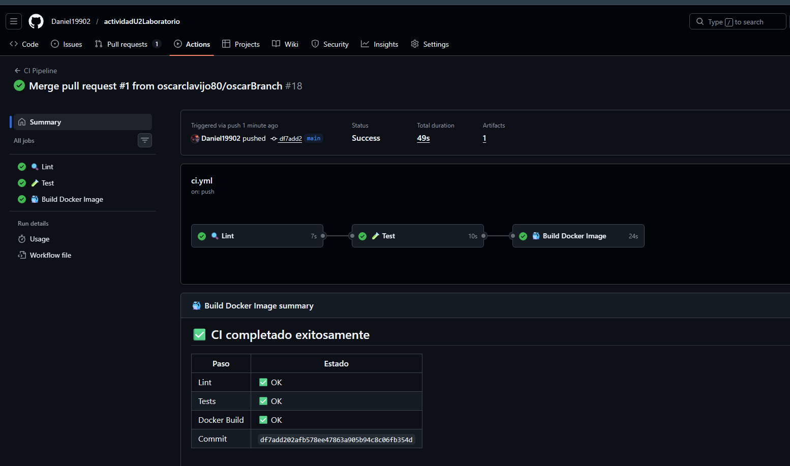
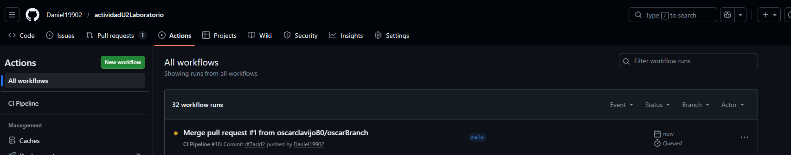
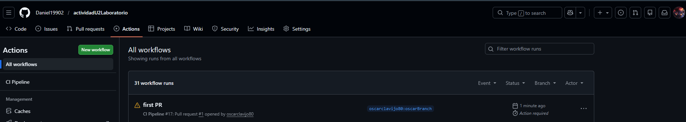
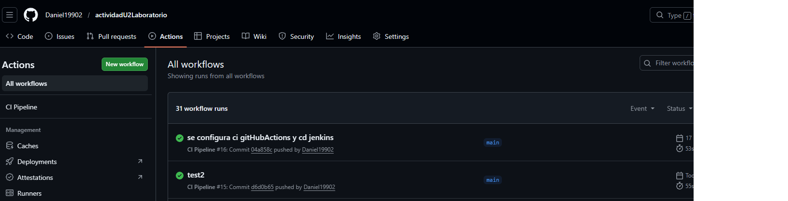
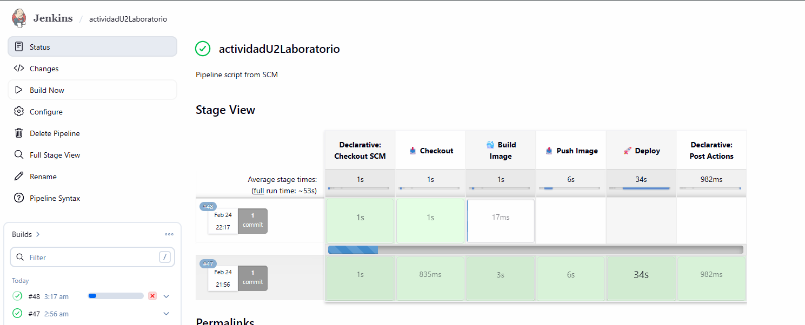
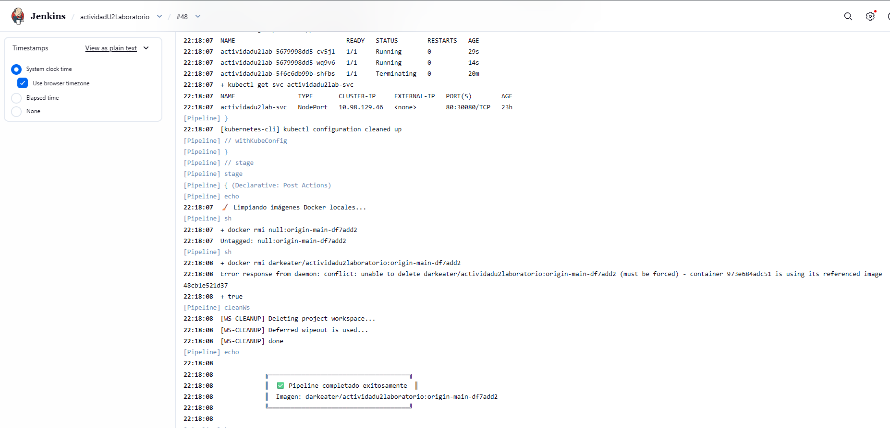
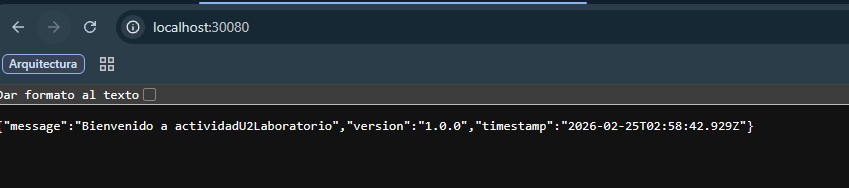

# actividadU2Laboratorio

Aplicación web **Node.js / Express** con pipelines **CI/CD** completos usando **GitHub Actions** y **Jenkins**.

---

## 📁 Estructura del proyecto

```
actividadU2Laboratorio/
├── src/
│   ├── app.js               ← Aplicación Express (exportable para tests)
│   └── index.js             ← Punto de entrada del servidor
├── tests/
│   └── app.test.js          ← Tests unitarios (Jest + Supertest)
├── .github/
│   └── workflows/
│       ├── ci.yml           ← GitHub Actions — CI Pipeline
├── jenkins/
│   ├── Dockerfile.jenkins   ← Imagen Jenkins con Docker + Node
│   ├── docker-compose.jenkins.yml ← Stack Jenkins local
│   └── plugins.txt          ← Plugins preinstalados
├── Jenkinsfile              ← Jenkins — CD Pipeline
├── Dockerfile               ← Imagen Docker multi-stage de la app
├── docker-compose.yml       ← Compose para desarrollo local
├── .eslintrc.json           ← Configuración ESLint
└── package.json             ← Scripts npm
```

---

## 🚀 Desarrollo local

### Prerrequisitos
- Node.js 18+
- Docker & Docker Compose

### Correr la app localmente (Node)
```bash
npm install
npm start
# → http://localhost:3000
```

### Correr tests y lint
```bash
npm test          # Tests con cobertura
npm run lint      # Análisis estático con ESLint
```

### Correr con Docker Compose
```bash
docker compose up --build
# → http://localhost:3000
```

### Endpoints disponibles

| Ruta | Método | Descripción |
|------|--------|-------------|
| `/` | GET | Mensaje de bienvenida + versión |
| `/health` | GET | Health-check (`{ "status": "ok" }`) |
| `/info` | GET | Versión de Node + uptime + entorno |

---

## ⚙️ CI con GitHub Actions

### CI Pipeline (`.github/workflows/ci.yml`)

**Disparador:** `push` y `pull_request` a `main` / `develop`

```
Checkout → 🔍 Lint → 🧪 Test (+ reporte cobertura) → 🐳 Build Docker
```

| Stage | Herramienta | Descripción |
|-------|-------------|-------------|
| **Lint** | ESLint | Análisis estático del código fuente |
| **Test** | Jest + Supertest | Tests unitarios con reporte de cobertura |
| **Build** | Docker Buildx | Verifica que el Dockerfile compile correctamente |

### CD Pipeline (`Jenkinsfile`)

**Disparador:** `push` a `pull_request` (o ejecución manual)

```
🐳 Build & Push (Docker Hub) → 🚀 Deploy (Kubernetes)
```

#### Secrets requeridos en Jenkins

> Settings → Secrets and variables

| Secret | Descripción |
|--------|-------------|
| `dockerhub-credentials` | Credenciales de Docker Hub |

---

### Levantar Jenkins localmente

```bash
cd jenkins/
docker compose -f docker-compose.jenkins.yml up -d
```

Abrir http://localhost:8080 y completar el wizard de configuración inicial.

#### Credenciales a configurar en Jenkins

> Manage Jenkins → Manage Credentials → Global

| ID de credencial | Tipo | Descripción |
|-----------------|------|-------------|
| `kube-config` | Secret File | Kubeconfig codificado en Base64 |

#### Crear el pipeline en Jenkins

1. **New Item** → Pipeline → nombre: `actividadU2Laboratorio`
2. **Pipeline** → Definition: `Pipeline script from SCM`
3. SCM: `Git` → Repository URL: `https://github.com/TU_USUARIO/actividadU2Laboratorio.git`
4. Branch: `*/main`
5. Script Path: `Jenkinsfile`
6. Guardar → **Build Now**

---

## 🐳 Imagen Docker

La imagen usa **multi-stage build**:

| Stage | Propósito |
|-------|-----------|
| `deps` | Instala solo dependencias de producción |
| `build` | Corre lint + tests (falla el build si algo falla) |
| `production` | Imagen final mínima (Alpine), usuario no-root |

```bash
# Construir localmente
docker build -t actividadu2lab:local .

# Verificar health-check
docker run -d -p 3000:3000 --name app actividadu2lab:local
curl http://localhost:3000/health
# → {"status":"ok"}
docker rm -f app
```

---

## 📊 Flujo CI/CD completo

```
Push a GitHub
     │
     ▼
┌─────────────────────────────────┐
│   GitHub Actions — CI Pipeline  │
│  Lint → Test → Build Docker     │
└────────────┬────────────────────┘
             │
             ▼
┌─────────────────────────────────┐
│   Jenkins — CD Pipeline         │
│  Build & Push DockerBub→ Deploy │
└─────────────────────────────────┘
```

---

## 📸 Evidencias de Ejecución Técnica

A continuación, se presentan las capturas que documentan la ejecución y el correcto funcionamiento de los pipelines de CI/CD:

### 1. Evidencia de Pull Request


### 2. Validaciones CI en GitHub Actions


### 3. Ejecución Automática de CI


### 4. Aprobación Pendiente de Pull Request


### 5. Ejecución en GitHub Actions (Push)


### 6. Ejecución de CD en Jenkins


### 7. Despliegue Exitoso


### 8. Aplicacion Funcional


---